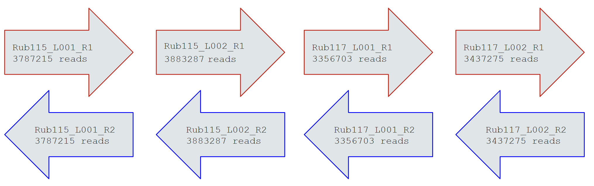
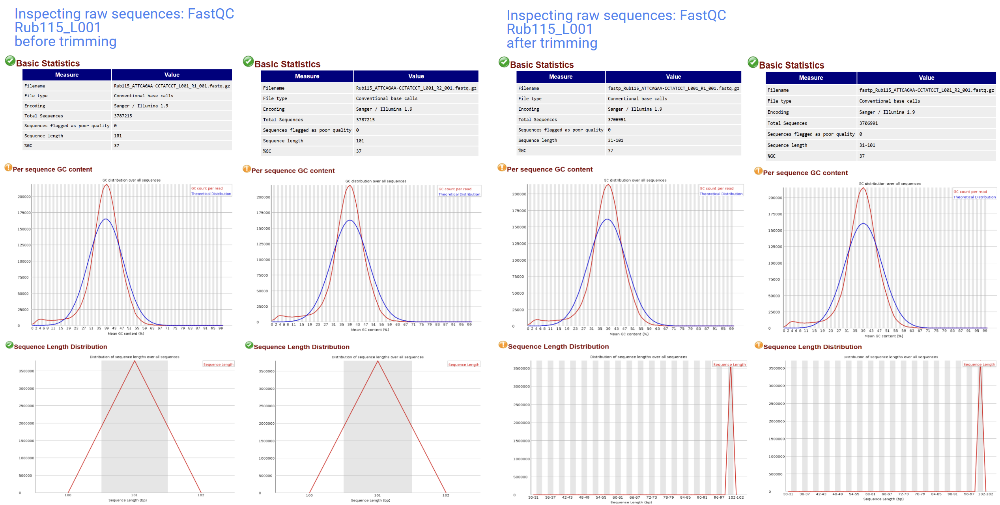
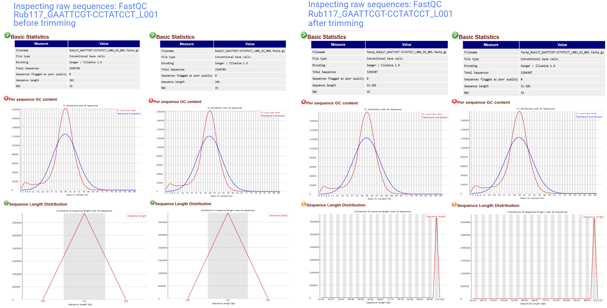
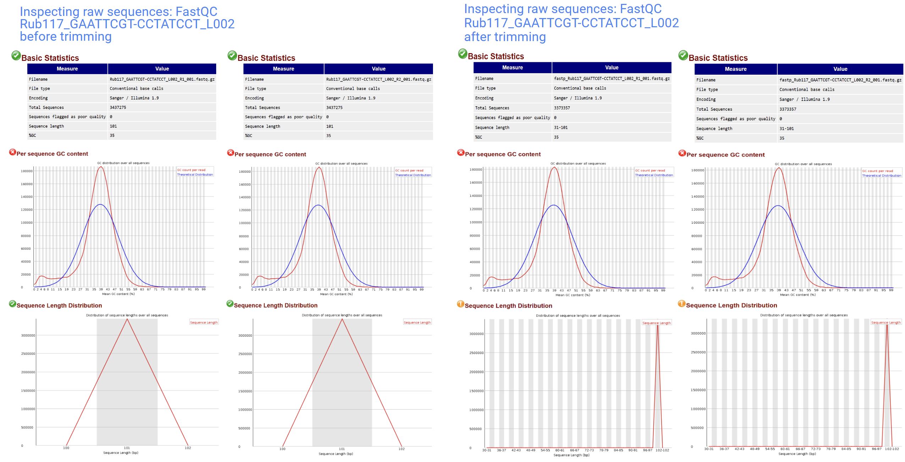
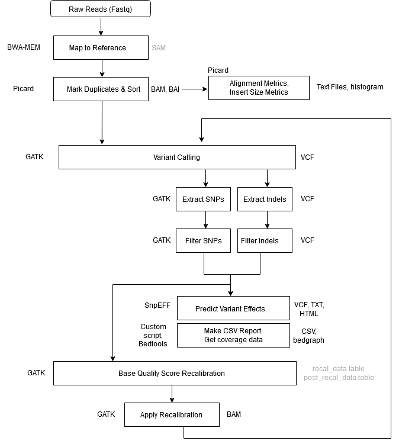
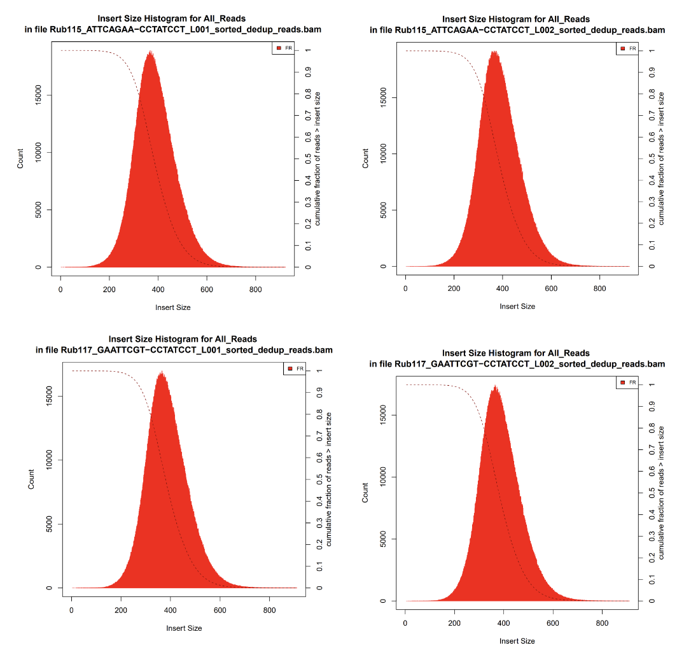

# Analysis of the genetic changes effect on the manifestation of the prion-like factor [MCS +] in *Saccharomyces cerevisiae* strains
**Student:**   
Sidorenko Oksana, Bioinformatics Institute   

**Supervisors:**   
Lavrentii Danilov,    
Department of Genetics and Biotechnology, SPbSU

Alexandr Rubel,    
Laboratory of Amyloid Biology, Department of Genetics and Biotechnology,
SPbSU

# Table of contents
1. [Introduction](#introduction)
2. [Aim](#aim)
3. [Tasks](#tasks)
4. [Raw data](#raw_data)
5. [Workflow](#workflow)
6. [Preparing the raw reds](#preparing_reads)
7. [Part 1: reference selection, alignment and variant calling](#part_1)
   * [Step 1: alignment – map to reference](#step_1)
   * [Step 2: mark duplicates + sort](#step_2)
   * [Step 3: collect alignment & insert size metrics](#step_3)
   * [Step 4: variant calling](#step_4)
   * [Step 5: extract SNPs & indels](#step_5)
   * [Step 6: filter SNPs](#step_6)
   * [Step 7: filter indels](#step_7)
   * [Step 8: exclude filtered variants](#step_8)
   * [Step 9: base Quality Score Recalibration (BQSR)](#step_9)
   * [Step 10: apply BQSR](#step_10)
   * [Step 11: variant calling](#step_11)
   * [Step 12: extract SNPs & indels](#step_12)
   * [Step 13: filter SNPs](#step_13)
   * [Step 14: filter indels](#step_14)
   * [Step 15: annotate SNPs and predict effects](#step_15)
   * [Overlaps between VCF files](#overlaps)
8. [Part 2: genome assembly](#part_2)
   * [Genome size estimation: raw reads](#genome_size_raw)
   * [Genome size estimation: corrected reads](#genome_size_cor)

## Introduction 

The increased interest in the study of amyloids is due to their
association with the development of a number of diseases in humans and animals, for example,
Alzheimer's and Parkinson's disease, type II diabetes, some types of cancer
diseases. Infectious amyloids (prions) capable of being transmitted both between cells of the same organism, and between
organisms are isolated into a separate group. In amyloid and prion diseases, extracellular or
intracellular accumulation of protein aggregates occurs. In addition to pathological
amyloids in various organisms, functional amyloids have been identified,
performing important biological functions. There are about 10 known
prions in the yeast *Saccharomyces cerevisiae*. In research led
Professor Yu. O. Chernoff in the yeast S. cerevisiae revealed a previously unknown
cytoplasmically inherited factor that exhibits characteristic properties
for prions. This prion-like factor was named [MCS + ]. Presence of this
factor in cells leads to a decrease in the accuracy of translation termination and
reading premature stop codons as significant. Structural protein of
the [MCS+] factor is currently unknown. At the same time, it is shown that its
manifestation in cells is associated with the presence in cells of unknown genetic
changes. That is, in strains that do not carry genetic changes, the factor
[MCS + ] is also contained, but has no manifestation. Thus, the identification
differences in the genomes of strains that differ in the manifestation of the factor [MCS + ],
will shed light on the nature of genetic factors influencing the manifestation
[MCS + ], and may also contribute to the discovery of the nature of the [MCS + ] factor itself.   

## Aim: 

Find changes in the *S. cerevisiae* genome (including genomic mutations) that affect
manifestation of yeast prion-like factor [MCS + ].  

## Tasks: 

1. Conduct data quality control;
2. Assemble the genomes of two strains;
3. Find SNPs unique to each strain;
4. Assess the presence of possible chromosomal rearrangements in the genomes of 2 strains.

## Raw data 

The available data at the start of the project were: four samples of Illumina paired end reads (two samples for each *S. cerevisiae* strain (with Rub_115 and Rub_117 prefixes, respectively)).

## Workflow 

The project combined two major tasks:   
1. Reference selection, alignment and variant calling;
2. Genome assembly.

## Preparing the raw reads 

The quality of raw paired reads was assessed in [FastQC](https://www.bioinformatics.babraham.ac.uk/projects/fastqc/). About 2% of reads in each sample were trimmed by [fastp](https://github.com/OpenGene/fastp?ysclid=lhgdfykpzu319786469) (v. 0.20.1, standard parameters) due to low quality and too many N.

## Part 1: reference selection, alignment and variant calling 

We used [variant calling pipeline](https://gencore.bio.nyu.edu/variant-calling-pipeline-gatk4/) with [GATK4](https://gatk.broadinstitute.org/hc/en-us) published by Mohammed Khalfan on 2020-03-25.    
Here we give an example of commands for one sample. All commands were executed similarly for all four samples.

### Step 1: alignment – map to reference 

Tool: [BWA-MEM](https://bio-bwa.sourceforge.net/)    

Input: .fastq files, reference genome

Output: aligned_reads.sam 

Notes:   
-Y tells BWA to use soft clipping for supplementary alignments;    
-K tells BWA to process INT input bases in each batch regardless of nThreads (for reproducibility);     
-R Readgroup header line such as '@RG\tID:foo\tSM:bar'. This information is key for downstream GATK functionality. GATK will not work without a read group tag.    

Command example:     
`$ bwa mem -t 8 -K 100000000 -Y -R '@RG\tID:Rub115_ATTCAGAA-CCTATCCT_L001\tLB:Rub115_ATTCAGAA-CCTATCCT_L001\tPL:ILLUMINA\tPM:HISEQ\tSM:Rub115_ATTCAGAA-CCTATCCT_L001' GCA_014898935.1_ASM1489893v1_genomic.fna.gz fastp_Rub115_ATTCAGAA-CCTATCCT_L001_R1_001.fastq fastp_Rub115_ATTCAGAA-CCTATCCT_L001_R2_001.fastq > Rub115_ATTCAGAA-CCTATCCT_L001_alignment.sam`

### Step 2: mark duplicates + sort 

Tool: GATK4 MarkDuplicatesSpark   

Input: aligned_reads.sam  

Output:   
sorted_dedup_reads.bam   
sorted_dedup_reads.bam.bai   
dedup_metrics.txt   

Notes:   
In GATK4, the Mark Duplicates and Sort Sam steps have been combined into one step using the MarkDuplicatesSpark tool. In addition, the BAM index file (.bai) is created as well by default. The tool is optimized to run on queryname-grouped alignments (that is, all reads with the same queryname are together in the input file). The output of BWA is query-grouped, however if provided coordinate-sorted alignments, the tool will spend additional time first queryname sorting the reads internally. Due to MarkDuplicatesSpark queryname-sorting coordinate-sorted inputs internally at the start, the tool produces identical results regardless of the input sort-order. That is, it will flag duplicates sets that include secondary, and supplementary and unmapped mate records no matter the sort-order of the input. This differs from how Picard MarkDuplicates behaves given the differently sorted inputs. (i.e. coordinate sorted vs queryname sorted). 

Command example:   
`$ gatk MarkDuplicatesSpark -I Rub115_ATTCAGAA-CCTATCCT_L001_alignment.sam -M Rub115_ATTCAGAA-CCTATCCT_L001_dedup_metrics.txt -O Rub115_ATTCAGAA-CCTATCCT_L001_sorted_dedup_reads.bam`

### Step 3: collect alignment & insert size metrics 

Tool: [Picard Tools](https://broadinstitute.github.io/picard/), [R](https://www.r-project.org/), [Samtools](https://www.htslib.org/)  

Input:   
sorted_dedup_reads.bam   
reference genome  

Output:   
alignment_metrics.txt     
insert_metrics.txt    
insert_size_histogram.pdf    
depth_out.txt   

Commands example:       
`$ java -jar apps/picard/2.17.11/picard-2.17.11.jar CollectAlignmentSummaryMetrics R=GCA_014898935.1_ASM1489893v1_genomic.fna I=Rub115_ATTCAGAA-CCTATCCT_L001_sorted_dedup_reads.bam O=Rub115_ATTCAGAA-CCTATCCT_L001_alignment_metrics.txt`

`$ java -jar apps/picard/2.17.11/picard-2.17.11.jar CollectInsertSizeMetrics INPUT=Rub115_ATTCAGAA-CCTATCCT_L001_sorted_dedup_reads.bam OUTPUT=Rub115_ATTCAGAA-CCTATCCT_L001_insert_metrics.txt HISTOGRAM_FILE=Rub115_ATTCAGAA-CCTATCCT_L001_insert_size_histogram.pdf`

`$ samtools depth -a Rub115_ATTCAGAA-CCTATCCT_L001_sorted_dedup_reads.bam > Rub115_ATTCAGAA-CCTATCCT_L001_depth_out.txt`

### Step 4: variant calling 

Tool: GATK4   

Input:   
sorted_dedup_reads.bam   
reference genome   

Output:   
raw_variants.vcf   

Notes:   
First round of variant calling. The variants identified in this step will be filtered and provided as input for Base Quality Score Recalibration (BQSR)

Commands example:    
`$ gatk CreateSequenceDictionary -R GCA_014898935.1_ASM1489893v1_genomic.fna # creating the FASTA sequence dictionary file`

`$ gatk HaplotypeCaller -R GCA_014898935.1_ASM1489893v1_genomic.fna -I Rub115_ATTCAGAA-CCTATCCT_L001_sorted_dedup_reads.bam -O Rub115_ATTCAGAA-CCTATCCT_L001_raw_variants.vcf`

### Step 5: extract SNPs & indels 

Tool: GATK4   

Input:    
raw_variants.vcf   
reference genome   

Output:    
raw_indels.vcf    
raw_snps.vcf   

Notes:   
This step separates SNPs and Indels so they can be processed and used independently

Commands example:   
`$ gatk SelectVariants -R GCA_014898935.1_ASM1489893v1_genomic.fna -V Rub115_ATTCAGAA-CCTATCCT_L001_raw_variants.vcf --select-type-to-include SNP -O Rub115_ATTCAGAA-CCTATCCT_L001_raw_snps.vcf` # separating SNPs

`$ gatk SelectVariants -R GCA_014898935.1_ASM1489893v1_genomic.fna -V Rub115_ATTCAGAA-CCTATCCT_L001_raw_variants.vcf --select-type-to-include INDEL -O Rub115_ATTCAGAA-CCTATCCT_L001_raw_indels.vcf` # separating indels

### Step 6: filter SNPs 

Tool: GATK4   

Input:   
raw_snps.vcf   
reference genome   

Output:   
filtered_snps.vcf   
filtered_snps.vcf.idx   

Notes:
QD < 2.0: This is the variant confidence (from the QUAL field) divided by the unfiltered depth of non-hom-ref samples. This annotation is intended to normalize the variant quality in order to avoid inflation caused when there is deep coverage. For filtering purposes it is better to use QD than either QUAL or DP directly.

SNPs which are ‘filtered out’ at this step will remain in the filtered_snps.vcf file, however they will be marked as ‘_filter’, while SNPs which passed the filter will be marked as ‘PASS’. We need to extract and provide only the passing SNPs to the BQSR tool, we do this in step 9. 

Command example:   
`$ gatk VariantFiltration -R GCA_014898935.1_ASM1489893v1_genomic.fna -V Rub115_ATTCAGAA-CCTATCCT_L001_raw_snps.vcf -O Rub115_ATTCAGAA-CCTATCCT_L001_filtered_snps.vcf -filter-name "QD_filter" -filter "QD < 2.0"`

### Step 7: filter indels 

Tool: GATK4   

Input:   
raw_indels.vcf   
reference genome  

Output:   
filtered_indels.vcf   
filtered_indels.vcf.idx   

Notes:   
QD < 2.0: This is the variant confidence (from the QUAL field) divided by the unfiltered depth of non-hom-ref samples. This annotation is intended to normalize the variant quality in order to avoid inflation caused when there is deep coverage. For filtering purposes it is better to use QD than either QUAL or DP directly.

Indels which are ‘filtered out’ at this step will remain in the filtered_indel.vcf file, however they will be marked as ‘_filter’, while Indels which passed the filter will be marked as ‘PASS’. We need to extract and provide only the passing Indels to the BQSR tool, we do this in step 9. 

Command example:   
`$ gatk VariantFiltration -R GCA_014898935.1_ASM1489893v1_genomic.fna -V Rub115_ATTCAGAA-CCTATCCT_L001_raw_indels.vcf -O Rub115_ATTCAGAA-CCTATCCT_L001_filtered_indels.vcf -filter-name "QD_filter" -filter "QD < 2.0"`

### Step 8: exclude filtered variants 
  

Tool: GATK4   

Input:   
filtered_snps.vcf   
filtered_indels.vcf   

Output:   
bqsr_snps.vcf   
bqsr_indels.vcf   

Notes:   
We need to extract only the passing variants and provide this as input to BQSR (next step). 

Commands example:   
`$ gatk SelectVariants --exclude-filtered -V Rub115_ATTCAGAA-CCTATCCT_L001_filtered_snps.vcf -O Rub115_ATTCAGAA-CCTATCCT_L001_bqsr_snps.vcf`

`$ gatk SelectVariants --exclude-filtered -V Rub115_ATTCAGAA-CCTATCCT_L001_filtered_indels.vcf -O Rub115_ATTCAGAA-CCTATCCT_L001_bqsr_indels.vcf`

### Step 9: base Quality Score Recalibration (BQSR) 

Tool: GATK4   

Input:   
sorted_dedup_reads.bam (from step 2)   
bqsr_snps.vcf   
bqsr_indels.vcf   
reference genome   

Output:   
recal_data.table

Notes:   
BQSR is performed twice. The second pass is optional, only required to produce a recalibration report. We preferred to skip the second pass.

Command example:   
`$ gatk BaseRecalibrator -R GCA_014898935.1_ASM1489893v1_genomic.fna -I Rub115_ATTCAGAA-CCTATCCT_L001_sorted_dedup_reads.bam --known-sites Rub115_ATTCAGAA-CCTATCCT_L001_bqsr_snps.vcf --known-sites Rub115_ATTCAGAA-CCTATCCT_L001_bqsr_indels.vcf -O Rub115_ATTCAGAA-CCTATCCT_L001_recal_data.table`

### Step 10: apply BQSR 

Tool: GATK4   

Input:   
recal_data.table   
sorted_dedup_reads.bam   
reference genome   

Output:   
recal_reads.bam   

Notes:    
This step applies the recalibration computed in the first BQSR step to the bam file. This recalibrated bam file is now analysis-ready. 

Command example:   
`$ gatk ApplyBQSR -R GCA_014898935.1_ASM1489893v1_genomic.fna -I Rub115_ATTCAGAA-CCTATCCT_L001_sorted_dedup_reads.bam -bqsr Rub115_ATTCAGAA-CCTATCCT_L001_recal_data.table -O Rub115_ATTCAGAA-CCTATCCT_L001_recal_reads.bam`

### Step 11: variant calling 

Tool: GATK4   

Input:    
recal_reads.bam   
reference genome   

Output:    
raw_variants_recal.vcf    

Notes:    
Second round of variant calling performed using recalibrated (analysis-ready) bam

Command example:    
`$ gatk HaplotypeCaller -R GCA_014898935.1_ASM1489893v1_genomic.fna -I Rub115_ATTCAGAA-CCTATCCT_L001_recal_reads.bam -O Rub115_ATTCAGAA-CCTATCCT_L001_raw_variants_recal.vcf`

### Step 12: extract SNPs & indels 

Tool: GATK4   

Input:   
raw_variants_recal.vcf   
reference genome   

Output:   
raw_indels_recal.vcf   
raw_snps_recal.vcf   

Notes:    
This step separates SNPs and Indels so they can be processed and analyzed independently

Commands example:    
`$ gatk SelectVariants -R GCA_014898935.1_ASM1489893v1_genomic.fna -V Rub115_ATTCAGAA-CCTATCCT_L001_raw_variants_recal.vcf -select-type-to-include SNP -O Rub115_ATTCAGAA-CCTATCCT_L001_raw_snps_recal.vcf` # separating SNPs

`$ gatk SelectVariants -R GCA_014898935.1_ASM1489893v1_genomic.fna -V Rub115_ATTCAGAA-CCTATCCT_L001_raw_variants_recal.vcf -select-type-to-include INDEL -O Rub115_ATTCAGAA-CCTATCCT_L001_raw_indels_recal.vcf` # separating indels

### Step 13: filter SNPs 

Tool: GATK4   

Input:   
raw_snps_recal.vcf    
reference genome   

Output:  
filtered_snps_final.vcf  
filtered_snps_final.vcf.idx  

Notes:  
QD < 2.0: This is the variant confidence (from the QUAL field) divided by the unfiltered depth of non-hom-ref samples. This annotation is intended to normalize the variant quality in order to avoid inflation caused when there is deep coverage. For filtering purposes it is better to use QD than either QUAL or DP directly.

SNPs which are ‘filtered out’ at this step will remain in the filtered_snps.vcf file, however they will be marked as ‘_filter’, while SNPs which passed the filter will be marked as ‘PASS’.

Command example:   
`$ gatk VariantFiltration -R GCA_014898935.1_ASM1489893v1_genomic.fna -V Rub115_ATTCAGAA-CCTATCCT_L001_raw_snps_recal.vcf -O Rub115_ATTCAGAA-CCTATCCT_L001_filtered_snps_final.vcf -filter-name "QD_filter" -filter "QD < 2.0"`

### Step 14: filter indels 

Tool: GATK4   

Input:  
raw_indels_recal.vcf  
reference genome  

Output:   
filtered_indels_final.vcf   
filtered_indels_final.vcf.idx   

Notes:  
QD < 2.0: This is the variant confidence (from the QUAL field) divided by the unfiltered depth of non-hom-ref samples. This annotation is intended to normalize the variant quality in order to avoid inflation caused when there is deep coverage. For filtering purposes it is better to use QD than either QUAL or DP directly.

Indels which are ‘filtered out’ at this step will remain in the filtered_indels.vcf file, however they will be marked as ‘_filter’, while Indels which passed the filter will be marked as ‘PASS’.

Command example:   
`$ gatk VariantFiltration -R GCA_014898935.1_ASM1489893v1_genomic.fna -V Rub115_ATTCAGAA-CCTATCCT_L001_raw_indels_recal.vcf -O Rub115_ATTCAGAA-CCTATCCT_L001_filtered_indels_final.vcf -filter-name "QD_filter" -filter "QD < 2.0"`

### Step 15: annotate SNPs and predict effects 

Tool: [SnpEff](https://pcingola.github.io/SnpEff/)

Input:   
filtered_snps_final.vcf   

Output:   
filtered_snps_final.ann.vcf   
snpeff_summary.html   
snpEff_genes.txt   

Commands example:   
`$ echo "scerevisiae.genome : scerevisiae" >> snpEff.config` # config editing

`$ mkdir -p data/scerevisiae` # creating folder for the database

`$ cp GCF_000146045.2_R64_genomic.gtf ../new_gatk/data/scerevisiae/genes.gtf` # putting there the .gbk reference file (unzipped and renamed to genes.gtf)

`$ cp ../alignment/GCA_014898935.1_ASM1489893v1_genomic.fna ../../apps/snpeff/4_3i/data/scerevisiae/sequences.fa` # putting there the reference .fasta file (renamed to sequences.fa)

`$ java -jar ../apps/snpeff/4_3i/snpEff.jar build -gtf22 -v scerevisiae` # creating the database

`$ ll ../../apps/snpeff/4_3i/data/scerevisiae/`                          
genes.gtf   
sequences.fa   
snpEffectPredictor.bin   

`$ java -jar ../../apps/snpeff/4_3i/snpEff.jar ann scerevisiae Rub115_ATTCAGAA-CCTATCCT_L001_filtered_snps_final.vcf -v > Rub115_ATTCAGAA-CCTATCCT_L001_filtered_snps_final.ann.vcf` # running SnpEff

This step was also repeated using gatk CNNScoreVariants:   
`$ gatk CNNScoreVariants -V Rub115_ATTCAGAA-CCTATCCT_L001_raw_variants_recal.vcf -R GCA_014898935.1_ASM1489893v1_genomic.fna -O Rub115_ATTCAGAA-CCTATCCT_L001_CNN_annotated.vcf`

The results matched for these two tools: there were 12315, 12352, 12239 and 12279 SNPs detected in Rub_115_L001, Rub_115_L002, Rub_117_L001, Rub_117_L002 samples, respectively.

We went through all the above steps with the reference *S. cerevisiae* strain S288C, but found about 25000 SNPs for each sample, so we changed the reference to *S. cerevisiae* strain 74-D694.

### Overlaps between VCF files 

We were interested in identifying SNPs unique to the two strains. In other words, by what variants do the strains differ from each other?   
We used bcftools v. 1.13 `index` and `isec` commands to intersect VCF files with SNPs received after pipeline execution. There were 96 SNPs unique for the strain 115 and 95 SNPs unique for the strain 117 detected. Of these, 5 and 11 SNPs were located in genes, passed filters and were not synonymous for strain 115 and strain 117, respectively.

115 unique SNPs (in genes, passed filters and not synonymous):

| Chromosome            | Position | Annotated gene    | Effect            |
|-----------------------|----------|-------------------|-------------------|
| JADBMI010000006.1 (V) | 95498    | *YEL030W (ECM10)* | GTC>CTC (Val>Leu) |
| CM026509.1 (VI)       | 16639    | *YNL331C (AAD14)* | CTG>GTG (Leu>Val) |
| CM026510.1 (VII)      | 1131344  | *YGR295C (COS6)*  | CTG>ATG (Leu>Met) |
| CM026510.1 (VII)      | 1131352  | *YGR295C (COS6)*  | CTT>CCT (Leu>Pro) |
| CM026515.1 (XIII)     | 597989   | *YMR173W-A* (-)   | AAT>AAG (Asn>Lys) |

117 unique SNPs (in genes, passed filters and not synonymous):

| Chromosome                    | Position | Annotated gene    | Effect            |
|-------------------------------|----------|-------------------|-------------------|
| CM026506.1 (I)                | 18862    | *YAL063C (FLO9)*  | GAC>GTC (Asp>Val) |
| CM026506.1 (I)                | 18949    | *YAL063C (FLO9)*  | TTT>TCT (Phe>Ser) |
| CM026506.1 (I)                | 205450   | *YHR211W (FLO5)*  | ACC>ATC (Thr>Ile) |
| CM026507.1 (II)               | 803305   | *YBR301W (PAU24)* | GTC>GCC (Val>Ala) |
| CM026508.1 (IV)               | 2055     | *YDL248W (COS7)*  | GTC>ATC (Val>Ile) |
| CM026508.1 (IV)               | 2060     | *YDL248W (COS7)*  | TGG>TGA (Trp>*)   |   
| CM026516.1 (XIV)              | 8540     | *YNL332W (THI12)* | ATG>ATT (Met>Ile) |
| CM026516.1 (XIV)              | 93745    | *YDR210W-B*       | GGA>GAA (Gly>Glu) |
| CM026518.1 (XVI)              | 881755   | *YPR181C (SEC23)* | GAG>GAT (Glu>Asp) |
| CM026519.1 (Plasmid 2-micron) | 1244     | not annotated     | AGT>AAT (Ser>Asn) |  
| JADBMI010000028.1 (Plasmid?)  | 14425    | *YHL040C (ARN1)*  | AAT>GAT (Asn>Asp) |

Of the detected SNPs, the following ones could be distinguished:

for the strain 115:
* *YEL030W (ECM10)*:    
**[*Saccharomyces* genome database (SGD)](https://www.yeastgenome.org/)**:   
Heat shock protein of the Hsp70 family; localized in mitochondrial nucleoids, plays a role in protein translocation, interacts with Mge1p in an ATP-dependent manner; overexpression induces extensive mitochondrial DNA aggregations; ECM10 has a paralog, SSC1, that arose from the whole genome duplication.  
**[The National Center for Biotechnology Information (NCBI)](https://www.ncbi.nlm.nih.gov/)**:   
Predicted to enable several functions, including ATP binding activity; ATP hydrolysis activity; and misfolded protein binding activity. Involved in protein targeting to mitochondrion. Located in mitochondrial nucleoid. Human ortholog(s) of this gene implicated in Parkinson's disease and autosomal dominant sideroblastic anemia 4. Orthologous to human HSPA9 (heat shock protein family A (Hsp70) member 9).

* *YMR173W-A*:    
**SGD**:   
Dubious open reading frame; unlikely to encode a functional protein, based on available experimental and comparative sequence data; overlaps the verified gene DDR48/YML173W.   
*DDR48/YML173W*, **SGD**:   
DNA damage-responsive protein; expression is increased in response to heat-shock stress or treatments that produce DNA lesions; contains multiple repeats of the amino acid sequence NNNDSYGS; protein abundance increases in response to DNA replication stress.  
*DDR48/YML173W*, **NCBI**:  
Enables ATP hydrolysis activity and GTPase activity. Involved in DNA repair. Located in cytosol.  

for the strain 117:
* CM026508.1 (IV), position 2060, TGG>TGA (Trp>*), *YDL248W (COS7)*:    
This SNP is more notable not for the gene in which it was located, but for the effect: the appearance of a premature stop codon, which echoes the described phenotype of the prion-like factor under study.  

## Part 2: genome assembly 

*De novo* genome assembly was performed with [SPAdes genome assembler](https://cab.spbu.ru/software/spades/) v3.15.4.   

Command example:   
`$ SPAdes-3.15.4-Linux/bin/spades.py -1 Rub115_ATTCAGAA-CCTATCCT_L001_R1_001.fastq -2 Rub115_ATTCAGAA-CCTATCCT_L001_R2_001.fastq -o ./assembly/Rub115_ATTCAGAA-CCTATCCT_L001` 

### Genome size estimation: raw reads 

We used three approaches to estimate the genome size:  
1. With [Jellyfish mer counter](https://genome.umd.edu/jellyfish.html) v. 2.3.0 and R;  
2. With [Genomescope web tool](http://www.genomescope.org/);  
3. With formula.

The first approach involves creating a .histo file and k-mer profile plotting in accordance with [this tutorial](https://koke.asrc.kanazawa-u.ac.jp/HOWTO/kmer-genomesize.html).

First, we run jellyfish with parameters:   
`-m` or “mer” specifies the length (23)   
`-C` tells it to ignore directionality (it treats each read the same as its reverse complement)   
`-t` number of threads   
`-s` is an initial estimate for the size of the hash table jellyfish uses   
`-o` specifies the name of the output file, we chose a name with the k-mer length (23) in it.   

Command example:  
`$ jellyfish count -C -m 23 -t 10 -s 2G -o Rub115_ATTCAGAA-CCTATCCT_L001_23.jf Rub115_ATTCAGAA-CCTATCCT_L001_R1_001.fastq Rub115_ATTCAGAA-CCTATCCT_L001_R2_001.fastq`

Then we made tables for histograms.  

Command example:  
`$ jellyfish histo Rub115_ATTCAGAA-CCTATCCT_L001_23.jf > Rub115_ATTCAGAA-CCTATCCT_L001_23.histo`

After that we run the R script (Scripts/k_mer_profile_raw_reads.Rmd) on the .histo files obtained as a result of executing the previous commands.

The second approach involves using the Genomescope web tool on these .histo files.

The third approach involves calculations by the formula:  
/(L%20-%20K%20&plus;%201)%7D)

### Genome size estimation: corrected reads 

SPAdes works in two-step mode: error correction and assembly. It contains corrected reads in the “corrected” folder. We repeated the k-mer profile plotting step and compared the results with the one for uncorrected reads. 